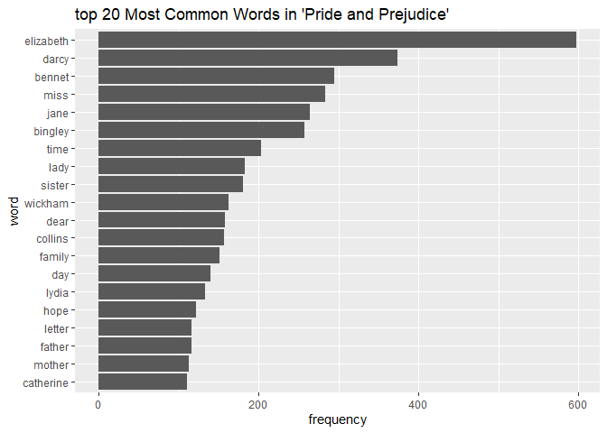

assignment4
================
yiwang
2023-11-24

Option A – Strings and functional programming in R

## exercise 1

I will use the tidytext package to remove the common stopwords

first install the required package

``` r
#install.packages("janeaustenr")
#install.packages("tidytext")
```

then load the required packages

``` r
library(janeaustenr)
```

    ## Warning: 程辑包'janeaustenr'是用R版本4.3.2 来建造的

``` r
library(tidytext)
```

    ## Warning: 程辑包'tidytext'是用R版本4.3.2 来建造的

``` r
library(dplyr)
```

    ## 
    ## 载入程辑包：'dplyr'

    ## The following objects are masked from 'package:stats':
    ## 
    ##     filter, lag

    ## The following objects are masked from 'package:base':
    ## 
    ##     intersect, setdiff, setequal, union

``` r
library(ggplot2)
library(stringr)
```

first load the book , i will use “pride and prejudice” as example

``` r
text <- austen_books() %>%
  filter(book == "Pride & Prejudice")

head(text)
```

    ## # A tibble: 6 × 2
    ##   text                  book             
    ##   <chr>                 <fct>            
    ## 1 "PRIDE AND PREJUDICE" Pride & Prejudice
    ## 2 ""                    Pride & Prejudice
    ## 3 "By Jane Austen"      Pride & Prejudice
    ## 4 ""                    Pride & Prejudice
    ## 5 ""                    Pride & Prejudice
    ## 6 ""                    Pride & Prejudice

then break the text into individual words

``` r
words <- text %>%
   unnest_tokens(word, text)
words
```

    ## # A tibble: 122,204 × 2
    ##    book              word     
    ##    <fct>             <chr>    
    ##  1 Pride & Prejudice pride    
    ##  2 Pride & Prejudice and      
    ##  3 Pride & Prejudice prejudice
    ##  4 Pride & Prejudice by       
    ##  5 Pride & Prejudice jane     
    ##  6 Pride & Prejudice austen   
    ##  7 Pride & Prejudice chapter  
    ##  8 Pride & Prejudice 1        
    ##  9 Pride & Prejudice it       
    ## 10 Pride & Prejudice is       
    ## # ℹ 122,194 more rows

then remove the stop words using stop_words

``` r
data("stop_words")
filtered_words <- words %>%
  anti_join(stop_words, by = "word")
filtered_words
```

    ## # A tibble: 37,246 × 2
    ##    book              word        
    ##    <fct>             <chr>       
    ##  1 Pride & Prejudice pride       
    ##  2 Pride & Prejudice prejudice   
    ##  3 Pride & Prejudice jane        
    ##  4 Pride & Prejudice austen      
    ##  5 Pride & Prejudice chapter     
    ##  6 Pride & Prejudice 1           
    ##  7 Pride & Prejudice truth       
    ##  8 Pride & Prejudice universally 
    ##  9 Pride & Prejudice acknowledged
    ## 10 Pride & Prejudice single      
    ## # ℹ 37,236 more rows

then count the words and sort it

``` r
word_counts <- filtered_words %>%
  count(word, sort = TRUE)
word_counts
```

    ## # A tibble: 6,009 × 2
    ##    word          n
    ##    <chr>     <int>
    ##  1 elizabeth   597
    ##  2 darcy       373
    ##  3 bennet      294
    ##  4 miss        283
    ##  5 jane        264
    ##  6 bingley     257
    ##  7 time        203
    ##  8 lady        183
    ##  9 sister      180
    ## 10 wickham     162
    ## # ℹ 5,999 more rows

then plot the top 20 words

``` r
top_words <- head(word_counts, 20)
ggplot(top_words, aes(x = reorder(word, n), y = n)) +
  geom_col() +
  labs(title = "top 20 Most Common Words in 'Pride and Prejudice'",
       x = "word",
       y = "frequency")+
  coord_flip()
```

<!-- -->

## exercise 2

here is my function definition

``` r
#' Convert to Custom Pig Latin
#'
#' This function converts English words to a custom version of Pig Latin.
#' The rearrangement component involves moving the last letter of the word
#' to the beginning. The addition component adds "xy" to the end of the word.
#'
#' @param word A character string representing a single English word.
#' @return A character string of the word converted to custom Pig Latin.
#' @examples
#' custom_pig_latin("hello")
#' custom_pig_latin("apple")
#' custom_pig_latin("strong")
#' @export
custom_pig_latin <- function(word) {
  # Validate input
  if (!is.character(word) || length(word) != 1) {
    stop("Input must be a single word (character string).")
  }

  if (nchar(word) == 0) {
    return("xy")
  }

  # Check if word starts with a vowel
  if (tolower(substr(word, 1, 1)) %in% c('a', 'e', 'i', 'o', 'u')) {
    # Move the last letter to the start and add "xy"
    return(paste0(substr(word, nchar(word), nchar(word)), substr(word, 1, nchar(word) - 1), "xy"))
  } else {
    # Move the first letter to the end, then the last to the start, and add "xy"
    return(paste0(substr(word, nchar(word), nchar(word)), substr(word, 2, nchar(word) - 1), substr(word, 1, 1), "xy"))
  }
}
```

here is the example

``` r
custom_pig_latin("hello") # "ohellxy"
```

    ## [1] "oellhxy"

``` r
custom_pig_latin("apple") # "eapplxy"
```

    ## [1] "eapplxy"

``` r
custom_pig_latin("strong") # "gstronxy"
```

    ## [1] "gtronsxy"

the test function

``` r
library(testthat)
```

    ## 
    ## 载入程辑包：'testthat'

    ## The following object is masked from 'package:dplyr':
    ## 
    ##     matches

``` r
# Begin test cases
test_that("Custom Pig Latin Conversion Works Correctly", {
  expect_equal(custom_pig_latin("hello"), "oellhxy")
  expect_equal(custom_pig_latin("apple"), "eapplxy")
  expect_equal(custom_pig_latin("strong"), "gtronsxy")
})
```

    ## Test passed 🥳

``` r
test_that("Handles Non-Standard Input", {
  expect_error(custom_pig_latin(123))
  expect_error(custom_pig_latin(TRUE))
  expect_error(custom_pig_latin(NULL))
})
```

    ## Test passed 🌈

``` r
test_that("Handles Empty and Single Character Strings", {
  expect_equal(custom_pig_latin(""), "xy")
  expect_equal(custom_pig_latin("a"), "axy")
})
```

    ## Test passed 🎊
